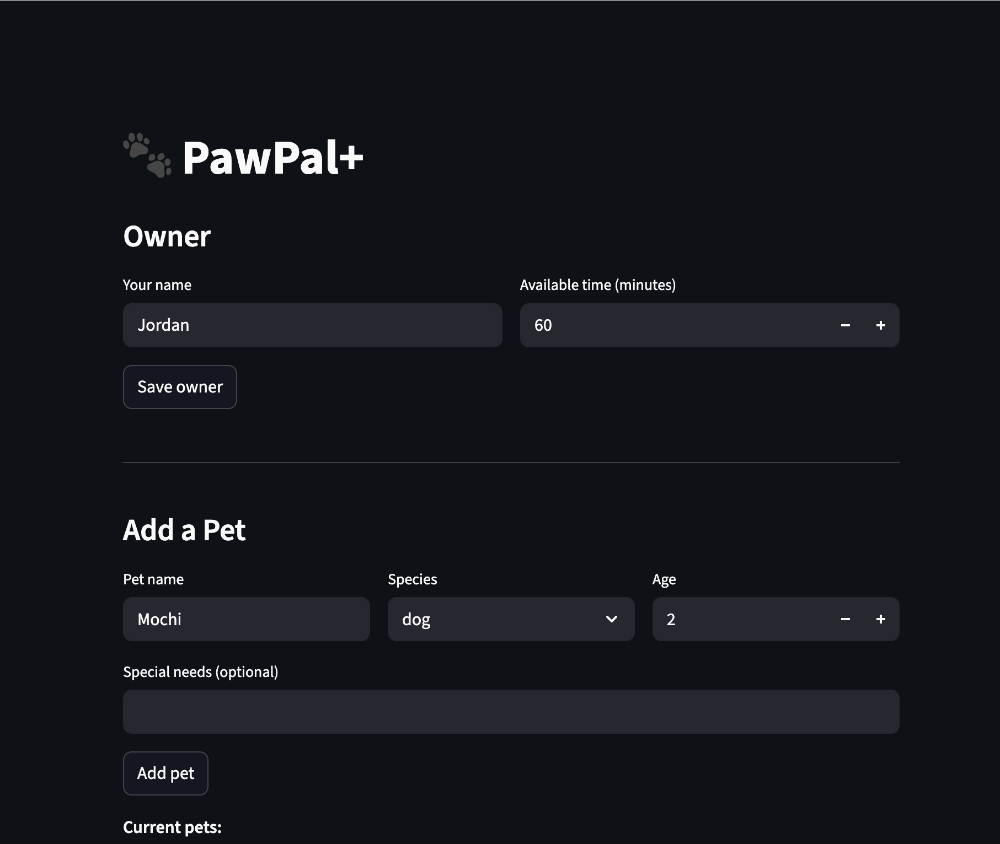

# PawPal+

**PawPal+** is a Streamlit app that helps busy pet owners build a consistent, prioritised daily care schedule across multiple pets. Add your pets and tasks, set time constraints, and PawPal+ will sort, schedule, and flag conflicts automatically.

---

## Features

### Priority-Based Sorting
Tasks are ranked using a three-level `Priority` enum — `HIGH`, `MEDIUM`, and `LOW` — with numeric values (3, 2, 1) that drive a stable descending sort. The scheduler always considers higher-priority tasks first, so a dog's medication will never be bumped by a lower-priority grooming session. Equal-priority tasks preserve their original insertion order (Python's sort is stable).

**Implemented in:** `Schedule.sort_tasks_by_priority()`

---

### Greedy Time-Fitting Scheduler
Given the owner's available minutes per day, the scheduler walks the priority-sorted task list and greedily adds each pending task if its duration fits within the remaining time budget. Tasks that are too long to fit are skipped — but the loop continues, so a smaller lower-priority task can still fill leftover time. This runs in O(n log n) time, dominated by the sort step.

**Implemented in:** `Schedule.fit_tasks_into_time()`

---

### Daily and Weekly Recurrence
Tasks can be marked `"daily"`, `"weekly"`, or `"once"`. When a recurring task is completed, `Pet.complete_task()` automatically calls `Task.recur()` to create a fresh, uncompleted copy with a new due date — `today + 1 day` for daily tasks, `today + 7 days` for weekly. One-off tasks return `None` from `recur()` and are never re-queued. This means the owner never has to manually recreate routine care tasks.

**Implemented in:** `Task.recur()` and `Pet.complete_task()`

---

### Conflict Detection
Before building the schedule, `detect_conflicts()` checks every pair of pending timed tasks using the standard interval overlap condition:

```
task A starts before task B ends  AND  task B starts before task A ends
```

Any overlap — whether two tasks start at the exact same time or one starts mid-way through another — produces a human-readable conflict message naming the pets and tasks involved. Tasks with an unrecognised time format produce a `Warning:` notice and are skipped gracefully rather than crashing the program.

**Implemented in:** `Schedule.detect_conflicts()`

---

### Task Filtering
The task list can be narrowed by completion status, pet name, or both, without modifying any underlying data. All filter parameters are optional — omitting both returns the full task list. This powers the All / Pending / Completed view in the UI.

**Implemented in:** `Schedule.filter_tasks(completed, pet_name)`

---

### Live Conflict Warnings in the UI
Conflict warnings surface in the app the moment a time constraint is entered — no need to generate the schedule first. Each conflict is displayed in a bordered card showing both clashing tasks side-by-side (pet name, task name, start time, duration) with an actionable tip to reschedule. Bad time-format warnings are collapsed into an expandable section so they don't clutter the main view.

**Implemented in:** `app.py → _render_conflicts()`

---

### Formatted Daily Plan
`explain_plan()` generates a terminal-style plan grouped by pet, with priority badges (`[!!!]` / `[!! ]` / `[!  ]`), a visual progress bar showing minutes used versus available, and a list of tasks that were skipped because they didn't fit. The plan is accessible via the **Build Schedule** button in the UI.

**Implemented in:** `Schedule.explain_plan()`

---

## 📸 Demo



*The Owner section lets you set your name and daily time budget. Add a Pet registers each animal by name, species, age, and any special needs. The task table below (not shown) displays all tasks sorted by priority with live conflict warnings.*

---

## Testing PawPal+

### Running the tests

```bash
python3 -m pytest tests/test_pawpal.py -v
```

### What the tests cover

| Test | What it verifies |
|------|-----------------|
| `test_mark_complete_changes_status` | Calling `mark_complete()` flips `completed` to `True` |
| `test_add_task_increases_pet_task_count` | `add_task()` appends the task to the pet's list |
| `test_sort_tasks_by_priority_returns_high_before_medium_before_low` | `sort_tasks_by_priority()` always returns HIGH → MEDIUM → LOW regardless of insertion order |
| `test_completing_daily_task_creates_next_occurrence` | Completing a `"daily"` task appends a fresh copy with `due_date = today + 1 day` and `completed = False` |
| `test_detect_conflicts_flags_same_start_time` | `detect_conflicts()` returns at least one `"Conflict"` warning when two tasks share the same start time |
| `test_detect_conflicts_flags_overlapping_windows` | A task starting mid-way through another is still caught as a conflict |
| `test_detect_conflicts_no_conflict_for_sequential_tasks` | Back-to-back tasks (one ends exactly when the next begins) are not flagged |
| `test_detect_conflicts_invalid_time_format_produces_warning` | A bad time string produces a `"Warning"` message instead of crashing |
| `test_completing_weekly_task_creates_next_occurrence_in_seven_days` | Completing a `"weekly"` task queues a copy due 7 days from today |
| `test_completing_once_task_does_not_create_next_occurrence` | A `"once"` task is never re-queued after completion |
| `test_fit_tasks_zero_available_time_schedules_nothing` | Owner with 0 minutes available gets an empty schedule |
| `test_fit_tasks_exact_time_fit_includes_task` | A task whose duration exactly equals available time is included |
| `test_fit_tasks_skips_tasks_that_dont_fit` | A large task that won't fit is skipped; smaller lower-priority tasks still get in |
| `test_fit_tasks_excludes_completed_tasks` | Already-completed tasks never appear in the scheduled output |
| `test_filter_tasks_completed_false_returns_only_pending` | `filter_tasks(completed=False)` returns only pending tasks |
| `test_filter_tasks_completed_true_returns_only_done` | `filter_tasks(completed=True)` returns only completed tasks |
| `test_filter_tasks_by_pet_name_returns_only_that_pets_tasks` | `filter_tasks(pet_name=...)` scopes results to one pet |
| `test_filter_tasks_unknown_pet_name_returns_empty` | An unknown pet name returns an empty list |
| `test_filter_tasks_no_args_returns_all` | Calling `filter_tasks()` with no arguments returns every task |

### Confidence Level: ⭐⭐⭐⭐ (4 / 5)

All 19 tests pass. The suite now covers every major subsystem:

- **Priority sorting** — correct order regardless of insertion sequence
- **Recurrence** — `daily`, `weekly`, and `once` frequencies all verified
- **Conflict detection** — same-time, overlapping, sequential (no conflict), and invalid format cases
- **Greedy scheduler** — zero budget, exact fit, tasks too large to fit, completed tasks excluded
- **Filtering** — all four combinations of `completed` and `pet_name` arguments

One star is held back because the Streamlit UI layer (`app.py`) and plan formatting (`explain_plan`) have no automated tests — those paths can only be verified manually through the browser.

## Getting started

### Setup

```bash
python -m venv .venv
source .venv/bin/activate  # Windows: .venv\Scripts\activate
pip install -r requirements.txt
```

### Suggested workflow

1. Read the scenario carefully and identify requirements and edge cases.
2. Draft a UML diagram (classes, attributes, methods, relationships).
3. Convert UML into Python class stubs (no logic yet).
4. Implement scheduling logic in small increments.
5. Add tests to verify key behaviors.
6. Connect your logic to the Streamlit UI in `app.py`.
7. Refine UML so it matches what you actually built.
